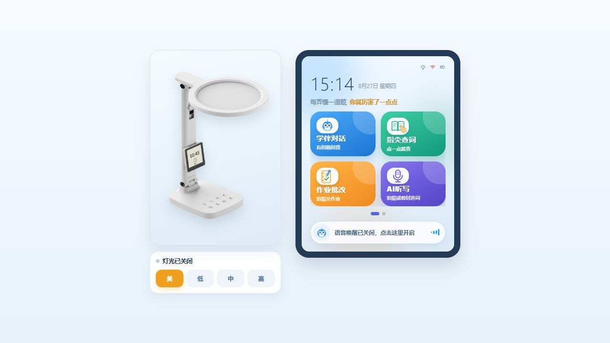
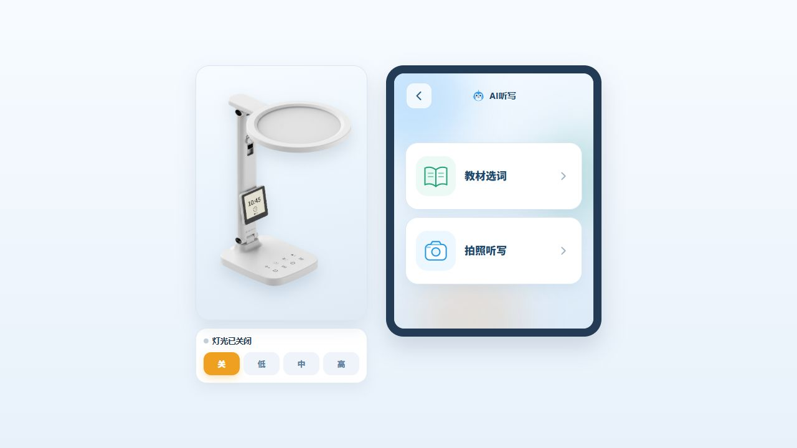
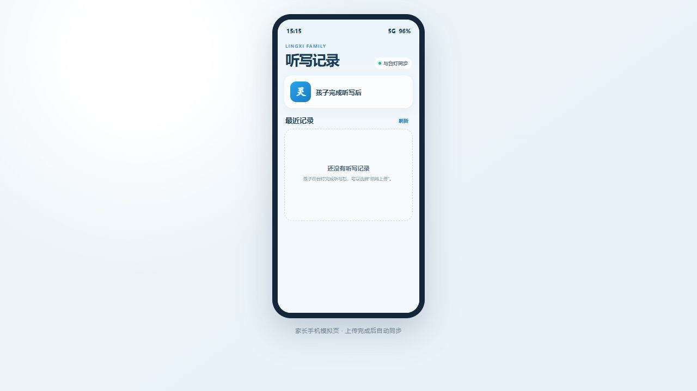
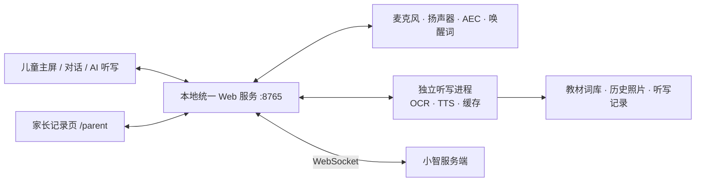

<div align="center">

# 小智智慧学习台灯

面向小智服务端的 Windows 智能学习终端，将语音学伴、台灯控制、AI 听写、拍照识别与家长记录整合到一个本地应用中。


[快速开始](#快速开始) · [功能介绍](#功能介绍) · [连接小智服务端](#连接小智服务端) · [常见问题](#常见问题)

</div>



## 项目简介

小智智慧学习台灯是一个可独立复制和部署的桌面端台灯项目。使用者只需运行一次 `python run.py`，即可启动本地网页、硬件音频、唤醒词、小智服务端连接、AI 听写和家长记录服务。

项目采用“本地终端 + 小智服务端”的组合方式：

- 小智服务端负责语音会话链路以及远端智能能力；
- 本地终端负责麦克风、扬声器、AEC 回声消除、唤醒词和灯光控制；
- AI 听写、教材词库、拍照 OCR、TTS 缓存和家长记录由本地统一服务提供；
- 儿童主屏、对话界面、听写界面和家长页面共用同一个启动入口。

> 本仓库是台灯终端，不包含小智云服务端。语音学伴功能需要连接一个可用的小智服务端；听写、教材选词和本地页面可独立运行。

## 功能介绍

| 功能 | 能力说明 |
| --- | --- |
| 小智语音学伴 | 连接小智服务端，支持唤醒、聆听、流式字幕、回答播报、打断和结束对话 |
| 台灯控制 | 网页和语音控制灯光开关、低/中/高亮度及扬声器音量 |
| 本地唤醒词 | 使用 Sherpa-ONNX 在本地检测唤醒词，减少无效网络请求 |
| AI 听写 | 支持小学语文和 PEP 小学英语教材选词，按册次、单元和课文组织内容 |
| 拍照听写 | 支持中文词语表、写字表和英文单词表 OCR，可裁剪、多页识别并人工确认 |
| 听写设置 | 支持顺序或随机播报、1～3 次重复、3～12 秒书写等待及单字词语提示 |
| TTS 播报 | 已合成内容优先读取本地缓存；无缓存内容可调用 DashScope CosyVoice 合成 |
| 听写过程控制 | 支持上一个、重复当前、暂停、继续、下一个、结束和再听一次 |
| 家长记录 | 孩子完成听写后可拍照上传，家长页面查看听写词表、参数和结果照片 |
| 本地统一服务 | 主屏、听写、家长端和 API 统一运行在同一端口，无需再启动 5003/5004 |

### AI 听写

从教材直接选词，或拍摄课本、词语表和单词表生成听写内容。OCR 运行在独立工作进程中，避免模型加载影响实时语音链路。



### 家长记录

完成听写后，孩子可在台灯端拍照上传结果。家长在同一局域网或本机打开家长页面即可查看记录。



## 系统架构



主进程以异步事件循环处理网页、WebSocket 和音频状态；OCR/ONNX 推理放在独立 Python 环境和工作进程中。OCR 进程空闲 5 分钟或累计执行 50 个重任务后自动回收，以降低常驻内存占用。

## 快速开始

### 运行环境

- 64 位 Windows 10 或 Windows 11；
- Python 3.10 或 3.11；
- 可用的麦克风和扬声器；
- 首次安装依赖时需要访问 PyPI；
- 使用语音学伴时，需要能够访问配置的小智服务端。

> 建议安装 Python 时勾选 **Add Python to PATH**。Python 3.13 可能暂时缺少部分音频依赖的预编译包。

### 方式一：一键启动（推荐）

双击项目根目录的：

```text
启动台灯.bat
```

首次运行会自动：

1. 创建主程序环境 `.venv`；
2. 创建听写工作进程环境 `.venv-dictation`；
3. 安装两套环境各自所需的依赖；
4. 启动本地服务、音频设备、唤醒词、AI 听写和小智连接；
5. 打开 `http://127.0.0.1:8765`。

后续仍然双击同一个文件即可。关闭程序时，在启动窗口按 `Ctrl+C`。

### 方式二：手动安装

在项目根目录打开 PowerShell：

```powershell
python -m venv .venv
python -m venv .venv-dictation

.\.venv\Scripts\python.exe -m pip install --upgrade pip
.\.venv\Scripts\python.exe -m pip install -r requirements.txt
.\.venv-dictation\Scripts\python.exe -m pip install -r requirements-dictation.txt
```

安装完成后，日常只需运行：

```powershell
.\.venv\Scripts\python.exe run.py
```

如果已经在正确的 Python 环境中安装全部依赖，也可以直接运行：

```powershell
python run.py
```

## 页面入口

程序启动后默认使用 8765 端口：

| 页面 | 地址 | 用途 |
| --- | --- | --- |
| 台灯主屏 | [http://127.0.0.1:8765](http://127.0.0.1:8765) | 学伴对话、台灯控制、AI 听写和设置 |
| 家长页面 | [http://127.0.0.1:8765/parent](http://127.0.0.1:8765/parent) | 查看孩子上传的听写记录 |
| 系统健康检查 | [http://127.0.0.1:8765/api/system/health](http://127.0.0.1:8765/api/system/health) | 查看主服务和听写工作进程状态 |

本项目不再需要单独运行 5003 或 5004 服务。

## 连接小智服务端

编辑 [`config/config.json`](config/config.json)，填写小智服务端地址和终端身份信息：

```json
{
  "SYSTEM_OPTIONS": {
    "CLIENT_ID": "保持稳定的客户端 ID",
    "DEVICE_ID": "保持稳定的设备 ID",
    "NETWORK": {
      "WEBSOCKET_URL": "ws://<小智服务端地址>:5000/xiaozhi/v1/",
      "WEBSOCKET_ACCESS_TOKEN": "<访问令牌>",
      "OTA_VERSION_URL": "http://<小智服务端地址>:8002/xiaozhi/ota/"
    }
  }
}
```

连接关系如下：

```text
台灯终端 run.py
  └─ WebSocket ──> 小智服务端 /xiaozhi/v1/
       ├─ ASR / 对话状态 / TTS 数据
       ├─ IoT 灯光与音量指令
       └─ 会话结束与重连事件
```

配置时请注意：

- `CLIENT_ID` 和 `DEVICE_ID` 用于标识当前终端，应保持稳定；
- `WEBSOCKET_URL` 必须能从运行台灯的电脑访问；
- 令牌无效、端口未开放或服务端未启动时，语音对话将无法连接；
- 小智连接失败不会阻止教材选词、拍照 OCR 和家长记录页面启动；
- 不要将真实访问令牌提交到公开仓库或写入 README。

## 配置说明

### 本地服务

[`config/runtime.json`](config/runtime.json) 只负责本地监听地址和端口：

```json
{
  "local_host": "127.0.0.1",
  "local_port": 8765
}
```

如果 8765 被占用，可改为 8766 等空闲端口，并使用新端口访问主屏和家长页面。

### 音频与唤醒词

以下内容位于 `config/config.json`：

- `AUDIO_DEVICES`：麦克风、扬声器、采样率、声道数和音量；
- `AEC_OPTIONS`：回声消除、能量阈值和静音判定；
- `WAKE_WORD_OPTIONS`：唤醒词开关、模型目录、线程数和阈值；
- `CAMERA`：摄像头编号及可选视觉服务地址。

把项目复制到另一台电脑后，最常需要重新设置的是 `AUDIO_DEVICES` 中的设备编号。唤醒词模型应保留在项目的 `models/` 目录中。

### 无缓存 TTS

AI 听写会优先使用本地 TTS 缓存。首次播报未缓存词条时，需要配置 DashScope API Key。推荐使用环境变量：

```powershell
$env:DASHSCOPE_API_KEY="<你的 API Key>"
python run.py
```

也可以在项目根目录创建本机专用的 `local_config.py`：

```python
DASHSCOPE_API_KEY = "<你的 API Key>"
```

`local_config.py` 已被 `.gitignore` 忽略。请勿提交、截图或分享真实 Key。未配置云端 TTS 时，浏览器会尝试使用系统语音作为回退，但不同电脑的可用语音和效果可能不同。

## 项目结构

```text
.
├─ run.py                       # 统一启动入口
├─ bridge.py                    # 网页、音频与小智服务端桥接
├─ 启动台灯.bat                # Windows 一键安装与启动
├─ config/                      # 小智、本地端口、音频与唤醒词配置
├─ models/                      # 本地唤醒词模型
├─ libs/                        # Opus / SpeexDSP 动态库
├─ src/
│  ├─ audio_codecs/             # 音频编解码
│  ├─ audio_processing/         # AEC 与音频处理
│  ├─ dictation/                # OCR、教材、TTS、API 与独立工作进程
│  └─ utils/                    # 配置和公共工具
├─ static/                      # 儿童主屏、对话、听写和家长端页面
├─ dictation_data/              # 教材词库、缓存、照片和家长记录
├─ tests/                       # 听写集成与 TTS 测试
├─ requirements.txt             # 主进程依赖
└─ requirements-dictation.txt   # OCR/TTS 工作进程依赖
```

## 运行测试

主程序和听写环境安装完成后，在项目根目录执行：

```powershell
.\.venv\Scripts\python.exe -m unittest discover -s tests -p "test_*.py" -v
node --check static\runtime.js
node --check static\dictation.js
```

Node.js 只用于检查前端脚本语法，不是正常运行台灯的必需依赖。

## 网页预览模式

如果只想查看界面，不启动麦克风、扬声器和小智连接：

```powershell
.\.venv\Scripts\python.exe preview.py
```

然后访问 `http://127.0.0.1:8766`。预览模式适合界面演示，不代表完整语音链路已经连接。

## 交付给其他人

复制或压缩整个项目目录，建议排除以下本机生成内容：

```text
.venv/
.venv-dictation/
__pycache__/
log/
bridge.log
local_config.py
```

交付包应保留 `run.py`、`bridge.py`、启动脚本、全部依赖清单，以及 `config/`、`models/`、`libs/`、`src/`、`static/`、`dictation_data/` 和根目录预录音频。

接收者需要重新填写自己的小智服务端地址、终端 ID、访问令牌、音频设备编号和 DashScope Key。

## 常见问题

<details>
<summary><strong>双击启动脚本后提示找不到 Python</strong></summary>

安装 64 位 Python 3.10 或 3.11，并在安装时勾选 **Add Python to PATH**。安装后重新打开启动窗口。

</details>

<details>
<summary><strong>页面打不开或提示 8765 端口被占用</strong></summary>

先关闭旧的台灯进程；如果端口仍被占用，修改 `config/runtime.json` 中的 `local_port`，再使用新端口访问页面。

</details>

<details>
<summary><strong>小智服务连接失败</strong></summary>

检查 `WEBSOCKET_URL`、访问令牌、服务端进程、防火墙和网络连通性。终端日志会打印当前连接地址和断开原因。

</details>

<details>
<summary><strong>没有声音或唤醒无反应</strong></summary>

先在 Windows 声音设置中确认麦克风和扬声器可用，再检查 `AUDIO_DEVICES` 的设备编号、麦克风权限以及 `bridge.log`。如果音频初始化失败，听写页面仍可能正常打开。

</details>

<details>
<summary><strong>拍照后无法识别</strong></summary>

确认 `.venv-dictation` 已正确安装 `requirements-dictation.txt`，照片清晰且裁剪框覆盖完整词表。首次 OCR 会加载模型，耗时通常高于后续识别。

</details>

<details>
<summary><strong>未缓存词条没有声音</strong></summary>

检查 `.venv-dictation` 中是否安装 `dashscope`，并确认 `DASHSCOPE_API_KEY` 已配置且可访问 DashScope。已缓存音频不依赖再次合成。

</details>

<details>
<summary><strong>PowerShell 禁止执行激活脚本</strong></summary>

无需激活虚拟环境，直接使用 `.\.venv\Scripts\python.exe` 执行安装和启动命令即可。

</details>

## 数据与安全

- 教材数据、OCR 历史照片、TTS 缓存和家长记录默认保存在本地项目目录；
- 小智语音会话会按配置连接远端服务端，请根据实际部署确认其数据策略；
- DashScope 仅在合成无缓存听写音频时使用；
- 对外分享项目前，请清理个人照片、听写记录、日志、访问令牌和 API Key；
- 当前项目未附带开源许可证时，不应默认视为允许公开再分发或商用。

---

<div align="center">

一个入口启动，一套界面使用，一条链路连接小智服务端。

</div>
