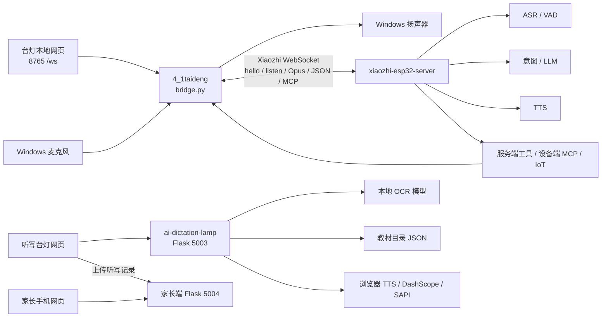
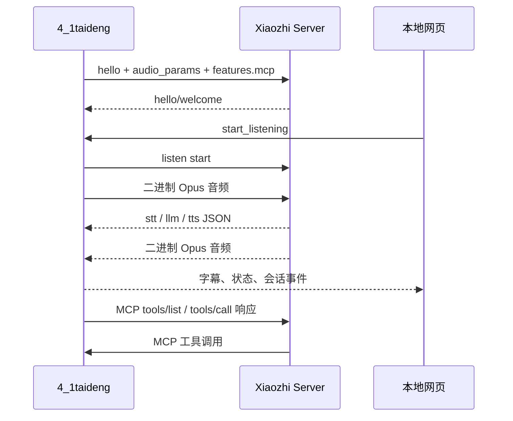

# 三个项目整体概念总结

> 形成时间：2026-08-25  
> 阅读范围：
> - `D:\qxyy\4_1taideng`
> - `D:\qxyy\tingxie_zhongduan\ai-dictation-lamp`
> - `D:\xiaozhi\xiaozhi-esp32-server`
>
> 本文基于目录、README、入口文件、配置、接口、关键处理模块和测试文件的静态阅读形成。此次没有启动服务、没有执行会产生外部副作用的操作，也没有修改任何现有代码。

## 一、先给结论

这不是一个已经合并成单体应用的项目，而是三个职责不同的系统：

1. `4_1taideng`：Windows 端的台灯/语音客户端桥接层，负责麦克风、扬声器、AEC、唤醒词、本地网页和 Xiaozhi WebSocket 连接。
2. `ai-dictation-lamp`：独立的 AI 听写业务应用，负责教材选词、拍照 OCR、词表整理、浏览器朗读和家长端记录。
3. `xiaozhi-esp32-server`：云端语音对话服务，负责接收 Opus 音频，完成 VAD/ASR、意图识别、LLM、工具调用、TTS，并把文字和音频返回客户端。

当前最重要的认知是：

- 第一和第三个项目已经通过 Xiaozhi WebSocket 协议形成了一条完整的语音对话链路。
- 第二个项目目前是另一条独立的“听写内容链路”，它没有从入口和前端调用上直接连接 `4_1taideng` 或 Xiaozhi 云端。
- “台灯亮度、音量、闹钟”等能力在 `4_1taideng` 中主要是本机软件状态和本地反馈；当前阅读到的代码里没有真正的 GPIO、串口、ESP32 灯控驱动。

## 二、整体架构图

## 三、项目一：`4_1taideng`

路径：`D:\qxyy\4_1taideng`

### 3.1 定位

这是一个可复制交付的 Windows 客户端目录。它把本机音频设备和 Xiaozhi 云端协议接起来，并用本地网页作为控制面板和字幕界面。

主要入口：

- `bridge.py`：核心桥接程序。
- `run.py`：启动配置、网页服务、音频、唤醒词和 Xiaozhi 连接。
- `启动台灯.bat`：Windows 一键启动入口。
- `static/index.html`、`static/runtime.js`、`static/runtime.css`：本地控制网页。
- `src/audio_codecs/`：音频采集、播放、Opus 编解码、AEC、能量检测。
- `src/audio_processing/wake_word_detect.py`：本地唤醒词检测。
- `models/`：唤醒词 ONNX 模型。

### 3.2 启动后的职责

`WebBridge` 同时维护四类状态：

- 浏览器连接集合：本地 `/ws` WebSocket 客户端。
- Xiaozhi 连接：远端 WebSocket、握手状态、重连状态。
- 音频状态：录音、播放、AEC、VAD、打断、静音和音频队列。
- 台灯业务状态：灯光档位、闹钟任务、扬声器音量、本地预录音反馈。

本地网页只发控制命令和接收状态/字幕，不直接传输麦克风音频。音频由 Python 进程通过 `sounddevice` 采集和播放。

### 3.3 与 Xiaozhi 的协议链路

客户端连接时会发送认证请求头，包含 `Authorization`、`Protocol-Version`、`Device-Id`、`Client-Id`。握手后发送类似以下能力声明：

- 文本：`type=hello`。
- 音频格式：Opus。
- 上行采样率：16 kHz，单声道，20 ms 帧。
- `features.mcp=true`：声明客户端支持设备端 MCP。

一轮对话大致是：

1. 本地唤醒词或网页按钮触发 `listen start`。
2. 麦克风音频经过 AEC、Opus 编码后，以二进制帧发送到云端。
3. 云端返回 `stt`、`tts`、`llm`、`server`、`mcp` 等 JSON 消息，以及二进制 Opus 音频。
4. 客户端把 STT/TTS/LLM 状态广播给网页，把音频解码后播放到扬声器。
5. 说话结束后，通过 VAD 或本地能量检测停止拾音；播放期间检测到人声时可以发 `abort` 实现打断。

### 3.4 本地网页命令

`bridge.py` 当前直接处理的网页命令包括：

- `start_listening`、`stop_listening`、`abort`。
- `set_dialog_microphone`：只控制当前对话页面的收音。
- `toggle_wake_word`：启用/停用本地唤醒词。
- `set_streaming_asr`：是否接受流式 ASR 字幕。
- `set_timer`、`cancel_timer`。
- `light_toggle`、`set_brightness`。
- `end_conversation`、`reconnect`。

网页接收的状态包括 `state`、`stt`、`tts`、`llm`、`session_end`、`wake_word`、`microphone`、`light_state`、`timer_*` 和错误消息。

### 3.5 MCP 与台灯能力

云端在握手时可以向客户端请求 MCP 初始化和工具列表。当前客户端向云端暴露了这些工具：

- `set_timer`、`cancel_timer`。
- `light_toggle`。
- `adjust_brightness`、`set_brightness`。
- `set_volume`、`adjust_volume`。

工具调用后，客户端会：

1. 修改本地内存中的灯光、音量或闹钟状态。
2. 向网页广播状态变化。
3. 播放本地预录音反馈，并同步发送字幕。
4. 通过 MCP 返回工具结果。

因此，当前“灯控”更准确地说是“台灯客户端状态模拟/软件控制层”。如果目标是控制实体灯泡，后续还需要明确接入 GPIO、串口、USB、ESP32 或其他 IoT 通道。

### 3.6 当前配置需要特别注意的地方

`config/config.json` 目前包含：

- 稳定的 `CLIENT_ID` 和 `DEVICE_ID`。
- Xiaozhi WebSocket 地址、OTA 地址和访问令牌字段。
- 唤醒词模型路径与阈值。
- AEC 和能量检测参数。
- 摄像头/视觉分析接口字段。

观察到的部署差异：当前客户端配置里的 WebSocket 地址使用了 `10.197.39.33:5000/xiaozhi/v1/`，而云端项目的默认 `config.yaml` 中 WebSocket 服务端口是 `8000`。这可能意味着前面还有反向代理、网关或历史端口配置，但仅从代码静态阅读无法确认，后续部署时必须核对实际监听端口、路径和代理规则。

## 四、项目二：`ai-dictation-lamp`

路径：`D:\qxyy\tingxie_zhongduan\ai-dictation-lamp`

### 4.1 定位

这是一个本地听写业务原型，核心目标不是开放式语音聊天，而是把教材词表或拍摄的词表转成可执行的听写队列，并给家长保存记录。

运行入口和端口：

- `app.py`：听写台灯端，默认 `127.0.0.1:5003`。
- `parent_app.py`：独立家长手机端，默认 `127.0.0.1:5004`。
- `ai-lamp-dictation.html` + `static/dictation.js`：听写主界面。
- `parent-phone.html` + `static/parent-phone.js`：家长查看记录界面。

README 中还保留了 `localhost:3800` 的兼容说明，因此 `5003/5004/3800` 是不同阶段或不同壳层之间的本地端口约定，不能直接当作同一个服务。

### 4.2 听写业务链路

听写端的主流程是：

1. 选择来源：教材选词或拍照听写。
2. 教材选词：按学段、学科、册次、单元、课文逐级加载目录。
3. 拍照听写：浏览器打开摄像头，拍摄并调整识别区域，可添加多页照片。
4. OCR：选择中文单字、中文词语或英文词汇模式，调用本地 OCR 模型。
5. 词表确认：展示识别出的词/字、原始文本、置信度、坐标和必要的纠错信息。
6. 设置听写：选择顺序、重复次数、间隔和提示方式。
7. 浏览器朗读：优先使用缓存音频和配置的 TTS 供应商，失败时可退回浏览器 TTS。
8. 结束后选择“拍照上传”，将照片和本次标准词表交给家长端保存。

### 4.3 后端模块

`app.py` 注册的主要能力：

- 历史照片：`/api/history`。
- OCR 同步接口：`POST /api/ocr/extract`。
- OCR 异步任务：`POST /api/ocr/jobs`、`GET /api/ocr/jobs/<job_id>`。
- OCR 预热：`POST /api/ocr/warmup`。
- OCR 可视化调试图：`POST /api/ocr/visualize`。
- 健康检查：`GET /api/health`。
- 教材目录：由 `backend/catalog.py` 提供分层 API。
- 字典示例：由 `backend/char_dictionary.py` 提供。
- TTS：由 `backend/tts_routes.py` 和 `backend/tts_provider.py` 提供。

OCR 采用单线程内存任务队列，进度会经过 `queued/running/completed/failed` 等状态。这样前端可以显示真实的阶段进度，但任务本身不属于云端队列，也不具备跨进程持久化能力。

### 4.4 数据和模型

- `data/catalog/`：中文和英文教材目录 JSON。
- `data/history/`：听写端历史照片。
- `data/parent_uploads/`：家长记录、上传照片和记录元数据。
- `data/ocr_results/`：OCR 调试输出。
- `vendor/tip-word/`：OCR、逐字框、词语匹配和可视化相关代码。
- `vendor/tip-word/models/`：Paddle/PaddleX/ONNX 模型文件。
- `cache/tts/`：TTS 音频缓存。

### 4.5 家长端边界

家长端不是同一个 Flask 应用中的页面，而是单独的 `5004` 服务。记录 API 支持：

- 按时间倒序查看听写记录。
- 查看单次记录的照片和词表。
- 删除记录中的照片。
- 从听写端上传一组照片和标准词表。

这是一个本机模拟的“家长手机端”，目前数据落在本地目录，尚未看到账号、远程数据库、云端同步或权限体系。

### 4.6 与 Xiaozhi 的关系

当前从 `app.py`、`parent_app.py`、前端脚本和后端模块的调用关系看：

- 听写端没有直接创建 Xiaozhi WebSocket 连接。
- 听写端没有使用 Xiaozhi 的 ASR/LLM/TTS 对话链路。
- 听写端的朗读是浏览器 TTS、本机 SAPI 或 DashScope CosyVoice 等本地业务 TTS 方案。
- 教材、OCR、听写队列和家长记录都在自己的 Flask/文件系统内完成。

所以第二个项目目前是“听写产品业务服务”，不是第一项目的一个已接入页面，也不是云端服务的一个子模块。

## 五、项目三：`xiaozhi-esp32-server`

路径：`D:\xiaozhi\xiaozhi-esp32-server`

### 5.1 定位

这是通用的小智语音服务端。虽然仓库名称带有 ESP32，但服务端本身并不只服务 ESP32，也可以服务当前 Windows 客户端这类遵循同一协议的设备。

主要入口：

- `main/xiaozhi-server/app.py`：启动 WebSocket 服务和 HTTP 服务。
- `main/xiaozhi-server/core/websocket_server.py`：WebSocket 监听、请求路径、认证和连接管理。
- `main/xiaozhi-server/core/connection.py`：单设备连接的完整生命周期和对话状态。
- `main/xiaozhi-server/core/handle/`：hello、listen、abort、音频、文本消息和工具消息处理。
- `main/xiaozhi-server/core/providers/`：ASR、VAD、LLM、TTS、意图、记忆、工具等可插拔实现。
- `main/xiaozhi-server/plugins_func/functions/`：服务端插件函数。
- `main/manager-web/`、`main/manager-api/`：配置和设备管理相关界面/服务代码。

### 5.2 服务端对话链路

单个设备连接后，云端大致按以下顺序工作：

1. WebSocket 层读取认证请求头和连接路径。
2. 收到 `hello` 后记录客户端音频参数和能力，并返回欢迎消息。
3. 收到 `listen start` 后进入拾音阶段。
4. 收到二进制 Opus 音频后进入 VAD 和 ASR。
5. ASR 产生最终文本后，先发送 `stt`，再进入意图处理。
6. 如果是直接意图或工具调用，则执行工具；否则把文本交给 LLM。
7. LLM 产生文本后进入 TTS，服务端发送 `tts start/sentence_start/stop` 和二进制 Opus 音频。
8. 连接结束、空闲超时或用户退出时发送 `session_end`，并清理连接资源。

服务端支持流式/非流式 ASR、多个 TTS 供应商、多种 LLM、记忆模块和多种工具执行器，具体使用哪一套由 `config.yaml` 或 manager-api 下发的配置决定。

### 5.3 工具体系

服务端统一工具层 `UnifiedToolHandler` 会汇总多类工具：

- 服务端插件工具。
- 服务端 MCP。
- 设备端 IoT 工具。
- 设备端 MCP 工具。
- 外部 MCP endpoint。

当前 `4_1taideng` 选择的是“设备端 MCP”路径：

1. 客户端在 `hello` 中声明 `features.mcp=true`。
2. 服务端向客户端发送 MCP `initialize` 和 `tools/list` 请求。
3. 客户端返回自己的工具描述。
4. 用户说“调亮一点”“设置闹钟”等话后，服务端的意图/LLM 选择合适工具。
5. 服务端通过 `type=mcp` 的 JSON-RPC `tools/call` 调用客户端工具。
6. 客户端执行本地状态变更、播放反馈并返回 MCP 结果。

服务端还支持另一种设备 IoT 描述符模式：设备发送属性和方法描述，云端自动生成查询/控制函数，再通过 `type=iot` 把控制命令下发给设备。当前桥接代码的主要实现是 MCP，而不是这套 IoT descriptor 模式。

### 5.4 HTTP 服务

服务端 HTTP 层主要提供：

- `/xiaozhi/ota/`：给设备下发或查询 WebSocket/OTA 相关信息。
- `/mcp/vision/explain`：视觉分析接口。

默认配置中：

- WebSocket 服务监听 `server.port`，默认 8000。
- HTTP/视觉服务使用 `server.http_port`，默认 8003。

仓库同时存在本地配置、manager-api 配置、Docker 配置和旧数据目录，因此实际部署地址需要结合当前启动方式确认，不能只看仓库默认值。

## 六、三者之间的真实关系

### 6.1 已经打通的部分

### 6.2 尚未打通的部分

`ai-dictation-lamp` 和另外两者之间目前没有明确的直接业务调用：

- 没有“听写词表 -> Xiaozhi 对话会话”的接口。
- 没有“Xiaozhi 语音识别结果 -> 听写判分/记录”的接口。
- 没有“云端用户/设备身份 -> 家长记录”的绑定关系。
- 没有统一的任务、会话、孩子、教材和设备数据模型。
- 没有统一的启动编排文件把 5003、5004、8765 和云端服务一起管理。

因此目前更像是两个产品方向并存：

- 语音助手/台灯控制产品：`4_1taideng` + Xiaozhi server。
- AI 听写/教材学习产品：`ai-dictation-lamp`。

## 七、当前代码给出的产品概念

可以把整个系统理解为四层：

### 7.1 设备交互层

负责真实世界的输入输出：麦克风、扬声器、唤醒词、AEC、播放打断、本地网页控制。

对应：`4_1taideng`。

### 7.2 对话智能层

负责把音频变成文本、把文本理解成意图、调用工具、生成回复和语音。

对应：`xiaozhi-esp32-server`。

### 7.3 学习内容层

负责教材目录、拍照 OCR、词语纠错/分词、听写顺序和提示策略。

对应：`ai-dictation-lamp` 的 `backend/`、`ocr/`、`data/catalog/` 和前端脚本。

### 7.4 家庭记录层

负责把孩子完成的听写照片和标准词表保存下来，供家长查看。

对应：`parent_app.py` 和 `backend/parent_records.py`。

## 八、值得后续重点确认的问题

这些不是本次修改项，而是形成整体概念后最值得优先确认的边界：

1. **实体灯控到底走哪条链路**：当前本地 MCP 工具只改内存状态；如果要控制真实灯具，需要选择 ESP32、串口、GPIO 或 IoT descriptor，并明确设备状态回传。
2. **听写是否要接入语音对话**：当前听写页面使用自己的 OCR/TTS/队列。如果要让用户通过 Xiaozhi 说“开始听写”“重复这个词”“下一题”，需要新增跨项目会话协议或把听写能力暴露为设备 MCP 工具。
3. **统一设备身份**：目前台灯客户端有 `CLIENT_ID/DEVICE_ID`，家长记录只有本地记录 ID，二者没有绑定模型。
4. **端口与反向代理**：客户端配置使用 5000 路径，服务端默认监听 8000；需要核对代理和实际部署，不宜直接改代码猜测。
5. **本地服务编排**：5003、5004、8765 当前各自启动，后续如做交付，需要决定是否统一由一个启动器或安装包管理。
6. **数据持久化边界**：桥接端的闹钟、亮度、音量是内存状态；听写历史和家长记录是本地文件；云端会话又有自己的连接级状态。
7. **安全边界**：当前多个服务面向 localhost 原型运行，API 主要依赖本机隔离；若开放到局域网或公网，需要补充认证、权限、上传校验和密钥管理。
8. **配置来源**：Xiaozhi server 同时支持本地 YAML 和 manager-api 配置；部署时需要确定唯一的配置来源，避免“改了文件但运行时没有生效”。

## 九、测试和工程成熟度概览

静态阅读到的测试重点如下：

- `4_1taideng`：AEC、音频链路相关测试。
- `ai-dictation-lamp`：OCR 解析、OCR 任务、目录、TTS、家长记录、前端契约测试。
- `xiaozhi-esp32-server`：连接、记忆、性能和测试页面等配套代码。

本次没有运行测试，因此本文不对当前运行结果、依赖安装情况、模型可用性或真实网络连通性做结论。

## 十、一句话心智模型

`4_1taideng` 是“耳朵、嘴巴和本地控制面板”，`xiaozhi-esp32-server` 是“云端听懂并决定做什么的大脑”，`ai-dictation-lamp` 是“教材、OCR 和听写业务系统”，`parent_app.py` 是“家庭记录查看端”；现在前两者已通过 Xiaozhi 协议连接，后两者仍是独立的本地业务链路。

---

## 十一、2026-08-25 合并实施结果

上文第一至十节是合并前的静态认知快照。当前已完成以下变化：

- AI 听写源码、5003 成品主屏、教材数据、历史数据、家长端页面、TTS 缓存和两份实际使用的 ONNX 模型已迁入 `4_1taideng`。
- 最终只有一个对外服务端口 `8765`；5003 和 5004 不再启动，家长端改为 `/parent`。
- 日常入口保持 `python run.py`，会同时托管小智对话和 AI 听写。
- OCR/TTS 重任务通过无端口内部工作进程按需启动，与实时音频主进程隔离；模型空闲 5 分钟或累计 50 个任务后回收。
- 麦克风上行改为单一发送协程和 25 帧有界队列；播放队列改为线程安全的 50 帧队列；唤醒词使用独立单线程执行器和 4 帧队列。
- 进入听写会停止小智拾音、清空音频、暂停唤醒词；退出听写或浏览器异常断开会恢复主模式。
- 历史图片改为按需读取，已保存图片通过 `assetId` 直接 OCR，不再重复上传；OCR 并发限制为一个运行加一个等待。
- 当前项目中没有旧 AI 听写目录的绝对路径依赖，也没有 Flask、5003、5004 运行依赖。

验证结果：Python/JavaScript 语法检查通过，5 项统一 API 自动化测试通过；小智 WebSocket 握手和 MCP 工具列表通过；合并后 OCR 在 CPU provider 下完成真实照片推理；浏览器主屏、听写入口、教材页、对话页和返回主屏流程无控制台错误。

受当前机器状态限制，默认 8765 已被既有 PID 22588 占用，当前终端会话的 MME 麦克风也返回设备参数错误，因此本次用临时 8876 端口和禁用音频的诊断模式验证统一启动。没有停止或修改 PID 22588，也没有修改云服务端项目。Windows SAPI 在本机没有可用语音，未命中缓存的听写 TTS 会按既有设计回退浏览器 `speechSynthesis`。
